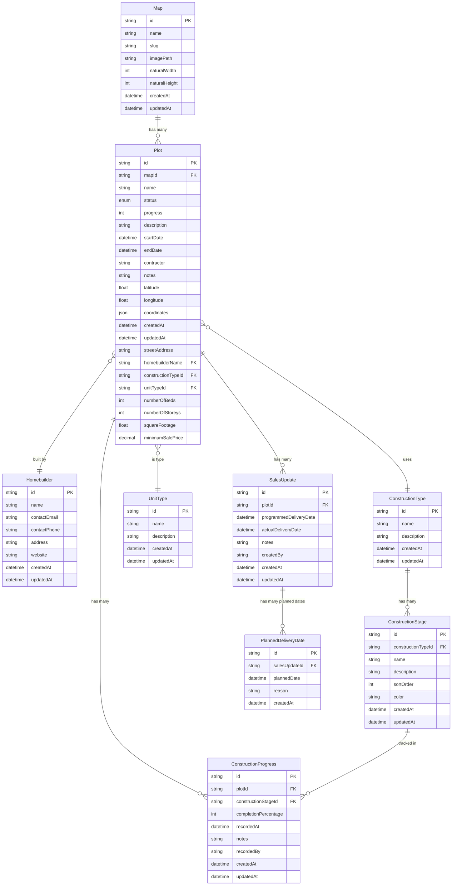

# Extended Database Schema for Construction Tracker

## Mermaid ERD

## Key Design Decisions

### 1. **Homebuilder Table**
- Separate table for homebuilders with contact information
- Allows for proper normalization and future expansion

### 2. **Construction Types & Stages**
- `ConstructionType` (Timber Frame, Blockwork) links to multiple stages
- `ConstructionStage` includes sort order and color for UI display
- Based on your image: stages like "Piling complete", "Oversite complete", etc.

### 3. **Sales Updates & Delivery Tracking**
- `SalesUpdate` contains one programmed and one actual date
- `PlannedDeliveryDate` allows multiple planned dates per sales update
- Tracks reasons for date changes

### 4. **Construction Progress Tracking**
- `ConstructionProgress` captures percentage completion over time
- Links to specific construction stages
- Includes timestamp and responsible person tracking

### 5. **Unit Types**
- Flexible unit type system for different property types
- Supports beds, storeys, square footage, and pricing

### 6. **Data Integrity**
- Foreign key relationships maintain data consistency
- Unique constraints where appropriate
- Audit fields (createdAt, updatedAt, createdBy) throughout

## Initial Data for Construction Types & Stages

### Timber Frame Construction
1. Piling complete (White/Grey)
2. Oversite complete (Yellow)
3. Timber frame complete (Light Green)
4. Roof tiling complete (Orange)
5. Brickwork complete (Dark Yellow)
6. Build complete (Blue)

### Blockwork Construction
1. Piling complete (White/Grey)
2. Oversite complete (Yellow)
3. Brickwork complete (Light Yellow)
4. Roof tiling complete (Orange)
5. Build complete (Blue)